# Learn CI/CD

## About this project

This project that will lead you to setup a CI/CD over a classic Vue.js Todo App, thanks to CircleCI and IBM Cloud.

This project should be carried out in groups of two.

This project takes a real-life approach to discovering the world of CI/CD. However, for educational reasons, certain shortcuts have been taken, and therefore do not represent the state of the art in software industry practices.

This project have been designed by Benjamin Chazelle.

## Define your group

Choose a teammate. 

Register your group on the Google Sheet related to this project :

https://docs.google.com/spreadsheets/d/1F27cjCCBFiiWhFDlQUEay4k6oGUdZ65pvUl6ESi7ENo/edit#gid=0

## Fork GitHub repository
  
Create GitHub account on [https://github.com/](https://github.com/)
  - Verify your e-mail

Fork the GitHub repository on [https://github.com/benjaminchazelle/learn-ci-cd](https://github.com/benjaminchazelle/learn-ci-cd)

Create a new codespace from your forked repository
- Your GitHub repository > Code > Create codespace on `main`
  
Fill your GitHub repository URL in the Google Sheet of the course, ask the teacher if needed.

## Prepare the git flow

```
main           ────o───────────────────────o──────  On git push/merge : CD
(prod)              \                     / 
                     \                   /
develop        ───────o───o───o─────────o─────────  On git push/merge : CI
(integration)                  \       / 
                                \     /
feat/***       ──────────────────o───o────────────  On git push : CI
(dev)
```

Here the target git flow we want to implement.

`main` branch that will contain the version of the stable code ready to be deployed in production.

`develop` branch is the integration branch where features are merged for testing before deployment.

`feat/***` or `fix/***` branches are branches branching off `develop` for developing new features or fixes. They are merged back into `develop` after completion.

Create a `develop`branch from `main`. 

## Continuous integration

We will firstly setup the continuous integration. The goal is simple : every time something is pushed into a git branch, we want to run a set of checks automatically that will be take into account by Pull requests in order to block the availability to merge if any error/regression/inconsistency is detected.

## Prepare SSH key pair

To communicate in a secure way, GitHub and CircleCI use SSH asymmetric encryption.

Generate a SSH public/private key pair.

Important : For pedagogical purposes, you can do it in the GitHub Codespace terminal, but be aware that in real life, these information are **very sensitive**, and should be generated locally and kept secret. **Do not commit them.**

```
mkdir .ssh
ssh-keygen -t ed25519 -f .ssh/project_key -C email@example.com
# Keep the passphrase empty
```

You should now have a private key `.ssh/project_key`  and the associated public key `.ssh/project_key.pub`.

The secret one will be used by CircleCI, and the public one by GitHub.
Add the public key as deploy key in your GitHub repository.
- GitHub repository > Settings > Deploy keys > Add deploy key
- Set title with "CircleCI deploy key"
- Copy/paste the public key
- Important : Allow write access

## Setup CircleCI

Create CircleCI account [https://circleci.com/signup/](https://circleci.com/signup/)
- Are you joining a team on CircleCI? *No, I’m setting up CircleCI for my team*
- Connect your GitHub account being careful to **install and authorize** your GitHub repository

Create CircleCI project (if CircleCI do not propose to do it on account creation, you do it via [https://app.circleci.com/](https://app.circleci.com/), clicking on `Create Project`)
- Copy/paster your private key
- Use the **faster** way to create the `config.yml`
- Create project

Check that a `circleci-project-setup` has been created by CircleCI in your GitHub repository with a new `config.yml` file.
- GitHub repository > branches > `circleci-project-setup` > `.circle/config.yml`


This file defines a `say-hello-workflow` workflow containing a singe `say-hello` job with two steps.

Access the CircleCI pipelines view https://app.circleci.com/pipelines, and check the CI workflow has been executed successfully on.


Merge the `circleci-project-setup` branch created by CircleCI in your repository.
- Open a pull request and merge it (be careful to merge from and into your own fork)

Check the CI workflow has been executed successfully on `develop` branch.


Retrieve the detail of the pipeline execution
- All Pipelines > Your successful pipeline on `develop` > `say-hello-workflow` > `say-hello` 


Fill the `Setup CircleCI` line in Google Sheet  

## Setup GitHub repository

Add collaborators (your teammate and @benjaminchazelle to your repository (with grant)
- GitHub repository > Settings > Collaborators > Add people

> We are about configuring the Pull request workflow in the repository. Our goal here is to force developers to have code review and a green CI before merge anything in the repository.

Configure branch and PR rules
- GitHub repository > Settings > Branches > Add branch protection rule
- Branch name pattern: `develop`
- Check **Require a pull request before merging**
	- Check  **Require approvals**
		- Require number of approvals before merging: 1
- Check **Require status checks to pass before merging**
	- Add the `say-hello` job
- Do not forget to click the `Create` button ;)

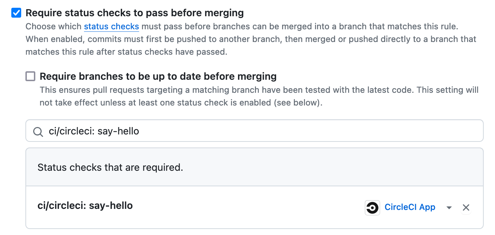

Fill the `Setup GitHub repository` line in Google Sheet  
## Setup GitHub codespace

Git fetch and pull to retrieve the merged `.circleci/config.yml` file into your current branch.

In a new terminal, install the project

```
npm install
```

In a new terminal, install and run the backend server (and let the tab open until the end of this project)

```
cd backend
npm run db-install
npm run dev
```

GitHub Codespace should automatically detect that the port `3000` is listened and forward it. If not, configure it manually in the `PORTS` tab.

Ensure you that the port is exposed with Public Visibility (If not, right-click on the forward rule to change it)

You should be able to access the backend server via an URL looking like `https://solid-xylophone-977w9jvxpv7vhp7r-3000.app.github.dev/`

Check you have the `Rock'n'roll !` message. If not, ask the teacher.

In a new terminal, install and run the frontend server (and let the tab open until the end of this project)

```
cd frontend
npm run dev
```

GitHub Codespace should automatically detect that the port `5173` is listened and forward it. If not, configure it manually in the `PORTS` tab.

Ensure you that the port is exposed with Public Visibility (If not, right-click on the forward rule to change it)

You should be able to access the backend server via an URL looking like `https://solid-xylophone-977w9jvxpv7vhp7r-5173.app.github.dev/`

Check you have access to the Vue.js app. Play with it.
- Sign-up the app (use random e-mail, username and password)
- Add some notes
- Mark some as done

Fill the `Setup GitHub codespace` line in Google Sheet  

## Backend CI : Lint

> A linter is a tool that helps identify issues, errors, and potential bugs in your code by analyzing its syntax, style, and best practices. It helps maintain code quality and consistency by providing suggestions or warnings for improvements.
> 
> Here, we want to run a such tool automatically in CI to be sure that every new code added to the codebase will be correctly lint.

Git fetch and switch to a new branch named `chore/add-backend-lint` from the remote `origin/develop` branch.

Edit the `.circleci/config.yml` to replace the `say-hello` job by a `backend-lint` one.

Do not hesitate to see the CircleCI documentation pages referenced into the file.

In the `jobs` main section, rename the `say-hello` section by `backend-lint`. 

Before the `run` section, add another run section to install node_modules via `npm install`.

Into the second `run` section :
- Change the name property with `Backend lint`
- Change the command property with `npm run lint-check`
- Add a `working_directory` property to run the script into the `backend/` directory

Update the `workspaces` main section to use the `backend-lint` job instead of `say-hello`.

Enjoy to rename the `say-hello-workflow` as `backend-ci-workflow`.

Git add, git commit, git push

Check the pipeline on your branch `chore/add-backend-lint` is in Success  https://app.circleci.com/pipelines. if not, fix and commit/push again, until the pipeline go to green.

Open a Pull request (Be careful to target the `develop` branch of  **YOUR** forked repo)
- Assign your teammate and `@benjaminchazelle` as Reviewers
- Your teammate have to approve the PR (GitHub Pull request > Files changed > Review changes > Approve)
- Check the `ci/circleci: backend-lint` check is green (if not, check the pipeline execution)
- Merge it

Update the protection rule of `develop` branch to be able to merge into the branch if and only if the `backend-lint` check is successful.
- GitHub repository > Settings > Branches > `develop`
- Click the `Save changes` button

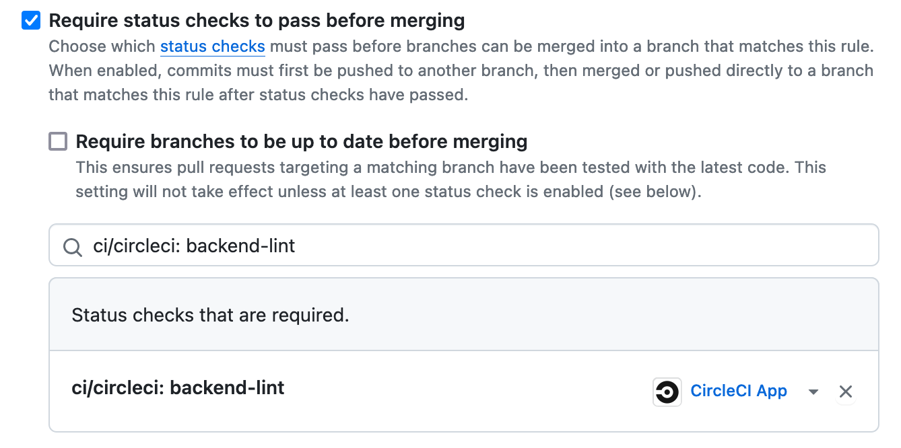
### Use case

> We will imagine that we want to add a new feature to improve the Password strength check on backend side

Git fetch and switch to a new branch `feat/backend-strong-password` from the remote `origin/develop` branch.

In `backend/routes/auth.ts` add the following code into the `/api/auth/register` endpoint, at line `29`.

```typescript
if (password.length < 8) { return error(400, "Too short password") }
```

Git commit and git push.

Open a Pull request (Be careful to target the `develop` branch of  **YOUR** forked repo)
- Assign your teammate and `@benjaminchazelle` as Reviewers
- Your teammate have to approve the PR (GitHub Pull request > Files changed > Review changes > Approve)
- Check the `ci/circleci: backend-lint` check is green (if not, check the pipeline execution and fix it, probably with a useful command hidden in the backend/package.json ;))
- Merge it

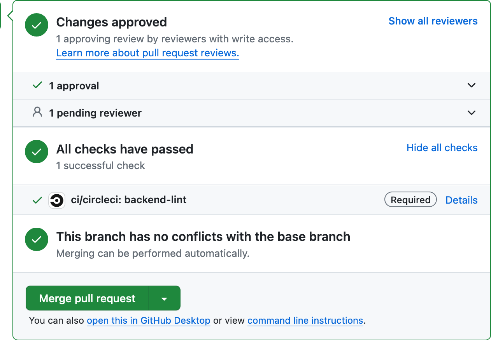

Fill the `Backend CI : Lint` line in Google Sheet  

## Backend CI : Type Check

> A type checker is a tool that analyzes code to ensure that variables, functions, and expressions have consistent and correct data types throughout the codebase. It helps catch errors early and enhances code reliability by enforcing type safety.
>
>Here, we want to run the TypeScript type checking automatically in CI to be sure that every new code added to the codebase will be consistent in data type point-of-view.

Git fetch and switch to a new branch named `chore/add-backend-type-check` from the remote `origin/develop` branch.

Edit the `.circleci/config.yml`

Add a new job `backend-type-check` in the `jobs` and `workflows.backend-ci-workflow.jobs` sections :
- Using the `node:lts` docker image
- Running `npm install` 
- Then running `npm run db-install` in `backend/` directory
- Then running `npm run type-check` in `backend/` directory
- Do not hesitate to see the CircleCI documentation pages referenced into the file.

Git add, git commit, git push

Check the pipeline on your branch `chore/add-backend-type-check` is in Success  https://app.circleci.com/pipelines. if not, fix and commit/push again, until the pipeline go to green.

Open a Pull request (Be careful to target the `develop` branch of  **YOUR** forked repo)
- Assign your teammate and `@benjaminchazelle` as Reviewers
- Your teammate have to approve the PR (GitHub Pull request > Files changed > Review changes > Approve)
- Check the `ci/circleci: backend-lint` and `ci/circleci: backend-type-check` checks are green (if not, check the pipeline execution)
- Merge it

Update the protection rule of `develop` branch to be able to merge into the branch if and only if the `backend-lint` and `backend-type-check` checks are successful.
- GitHub repository > Settings > Branches > `develop`
- Click the `Save changes` button

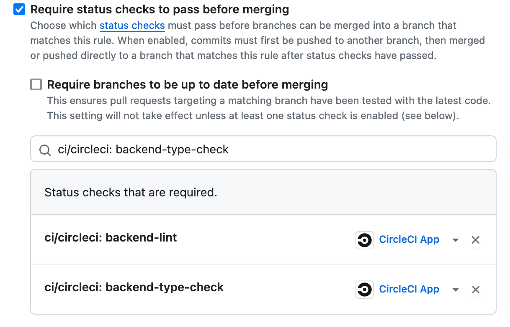

### Use case


> We will imagine that we want to add a new feature to improve the Password strength check on backend side


Git fetch and switch to a new branch `feat/backend-stronger-password` from  the remote `origin/develop` branch.

In `backend/routes/auth.ts` replace the password length check with a function invokation into the `/api/auth/register` endpoint, near line `29`.

```typescript
if (!isValidPassword(password)) { return error(400, 'Invalid password') }
```

Define the function at the top of the file

```typescript
export function isValidPassword(password) {
     // Contains at least 8 characters and a number
     return password.length >= 8 && password.match(/[0-9]/) !== null
}
```

Git commit and git push.

Open a Pull request (Be careful to target the `develop` branch of  **YOUR** forked repo)
- Assign your teammate and `@benjaminchazelle` as Reviewers
- Your teammate have to approve the PR (GitHub Pull request > Files changed > Review changes > Approve)
- Check the `ci/circleci: backend-lint`  and `ci/circleci: backend-type-check` checks are green (if not, check the pipeline execution and fix it)
- Merge it

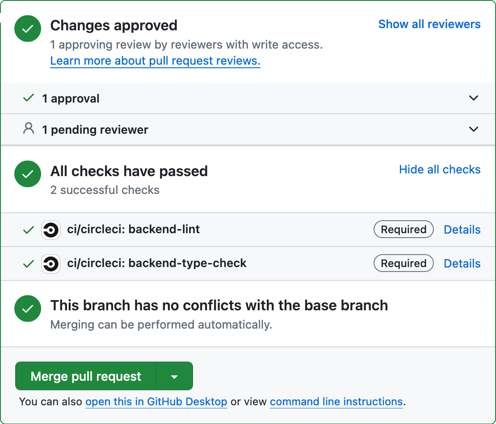

Fill the `Backend CI : Type-check` line in Google Sheet  
## Backend CI : Unit Tests

> Unit tests are automated tests designed to validate the individual components (units) of a codebase in isolation. They verify that specific functions, classes, or modules perform as expected, helping ensure the reliability and correctness of the code.
>
>Running unit tests on a regular basis is an excellent way to find code regression, that's why it is very interesting to have in CI.
  
Git fetch and switch to a new branch named `chore/add-backend-unit-tests` from the remote `origin/develop` branch.

In the previous CI job, `eslint` and `tsc`, the binaries invoked by npm run commands was already installed in the project. Here, we have to setup a unit test framework from scratch.

Install `jest`, `ts-jest` and `@types/jest` as development dependencies in the `backend` directory.
- `npm install -D jest ts-jest @types/jest`

Initialize the unit tests configuration file `backend/jest.config.cjs`

```javascript
/* eslint-disable */
/** @type {import('ts-jest').JestConfigWithTsJest} */

module.exports = {
    preset: 'ts-jest',
    testEnvironment: 'node',
};
```

Add a script into `package.json` to run unit tests
- `"unit-tests": "jest --passWithNoTests"`

Check you can well run unit tests via `npm run unit-tests`

Then, let's continue with CI configuration. Edit the `.circleci/config.yml`

Add a new job `backend-unit-tests` in the `jobs` and `workflows.backend-ci-workflow.jobs` sections :
- Using the `node:lts` docker image
- Running `npm install` 
- Then running `npm run db-install` in `backend/` directory
- Then running `npm run unit-tests` in `backend/` directory
- Do not hesitate to see the CircleCI documentation pages referenced into the file.

Git add, git commit, git push

Check the pipeline on your branch `chore/add-backend-unit-tests` is in Success  https://app.circleci.com/pipelines. if not, fix and commit/push again, until the pipeline go to green.

Open a Pull request (Be careful to target the `develop` branch of  **YOUR** forked repo)
- Assign your teammate and `@benjaminchazelle` as Reviewers
- Your teammate have to approve the PR (GitHub Pull request > Files changed > Review changes > Approve)
- Check the `ci/circleci: backend-lint`, `ci/circleci: backend-type-check`  and `ci/circleci: backend-unit-tests` checks are green (if not, check the pipeline execution)
- Merge it

Update the protection rule of `develop` branch to be able to merge into the branch if and only if the `backend-lint`, `backend-type-check` and `backend-unit-tests`  checks are successful.
- GitHub repository > Settings > Branches > `develop`
- Click the `Save changes` button

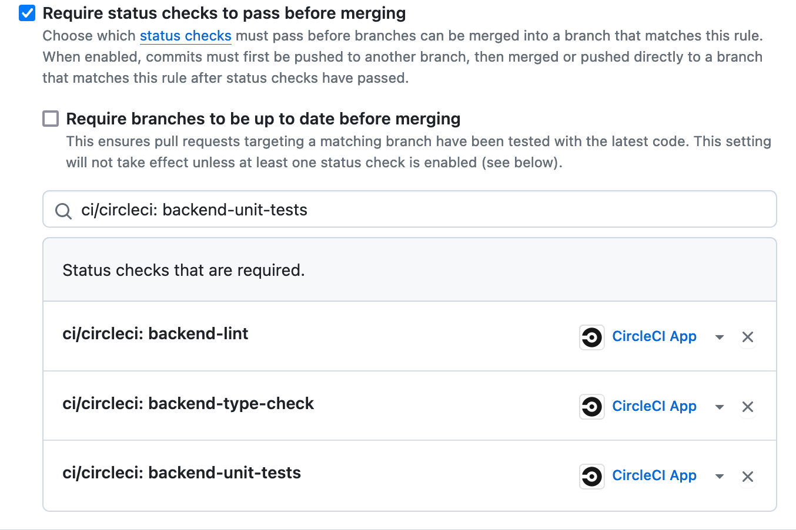

### Use case


> We will add a unit test about the improvement of the password strength check on backend side
> 
> Note : In real life,  unit tests should be added to the codebase with the new feature, and not after.


Git fetch and switch to a new branch `feat/backend-stronger-password-unit-tests` from  the remote `origin/develop` branch.

Add a test `backend/tests/pasword.spec.ts`

```typescript
import { isValidPassword } from "../routes/auth"

describe("Password strength test", () => {

	it("Positive", () => {
		expect(isValidPassword("Hello wor1d")).toBe(true);
		expect(isValidPassword("H3llo wOrld")).toBe(true);
		expect(isValidPassword("Hello wOrld!")).toBe(true);
		expect(isValidPassword("He11o world")).toBe(true);
		expect(isValidPassword("Hellow0rd")).toBe(true);
	})
	
	it("Negative", () => {
		expect(isValidPassword("hello world")).toBe(false);
		expect(isValidPassword("43110")).toBe(false);
		expect(isValidPassword("hello")).toBe(false);
		expect(isValidPassword("hell0")).toBe(false);
		expect(isValidPassword("hello world!")).toBe(false);
	})

})
```

Git commit and git push.

Open a Pull request (Be careful to target the `develop` branch of  **YOUR** forked repo)
- Assign your teammate and `@benjaminchazelle` as Reviewers
- Your teammate have to approve the PR (GitHub Pull request > Files changed > Review changes > Approve)
- Check the `ci/circleci: backend-lint` , `ci/circleci: backend-type-check` and `ci/circleci: backend-unit-tests` checks are green (if not, check the pipeline execution and fix the bad assertion ;))
- Merge it

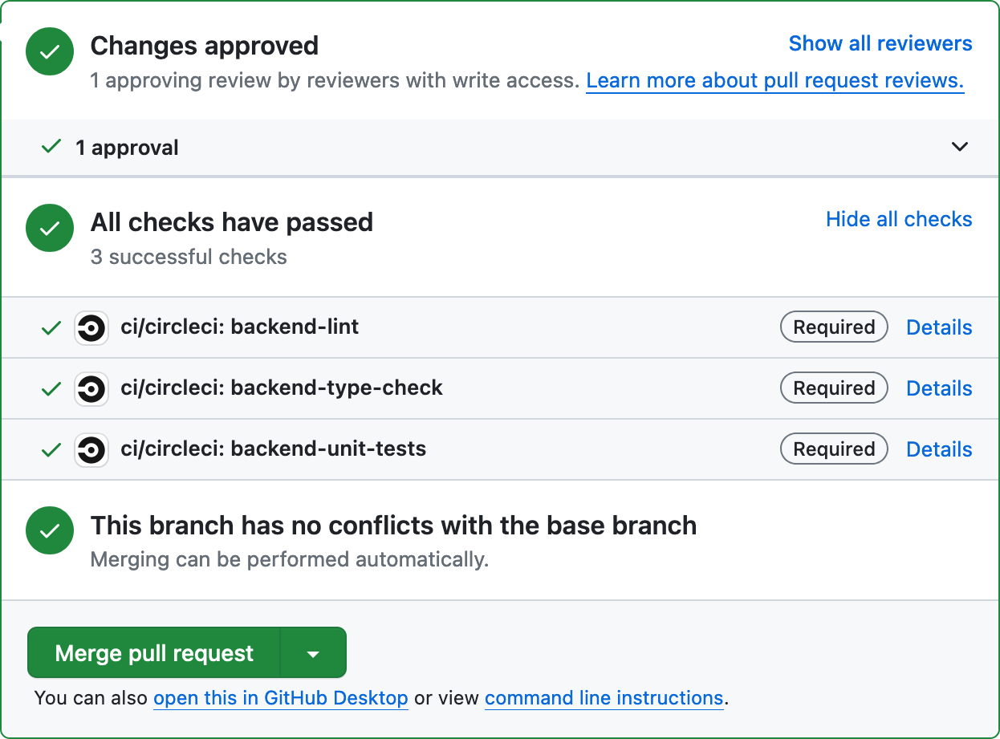

Fill the `Backend CI : Unit Tests` line in Google Sheet  
## Frontend CI : Lint, Type check and Unit Tests

Git fetch and switch to a new branch named `chore/add-frontend-ci` from the remote `origin/develop` branch.

Edit the `.circleci/config.yml` to add the `frontend-ci-workflow`, containing `frontend-lint`, `frontend-type-check` and `frontend-unit-tests` jobs.

The `frontend-type-check` check will need to `npm install` and `npm run db-install` from `backend/` directory, because, frontend type are inferred from the backend endpoints and ORM.

All npm scripts you need are available in `frontend/` directory.

Do not hesitate to see the CircleCI documentation pages referenced into the file.

Git add, git commit, git push

Update the protection rule of `develop` branch to be able to merge into the branch if and only if the `backend-*` and `frontend-*`  checks are successful.
- GitHub repository > Settings > Branches > `develop`
- Click the `Save changes` button

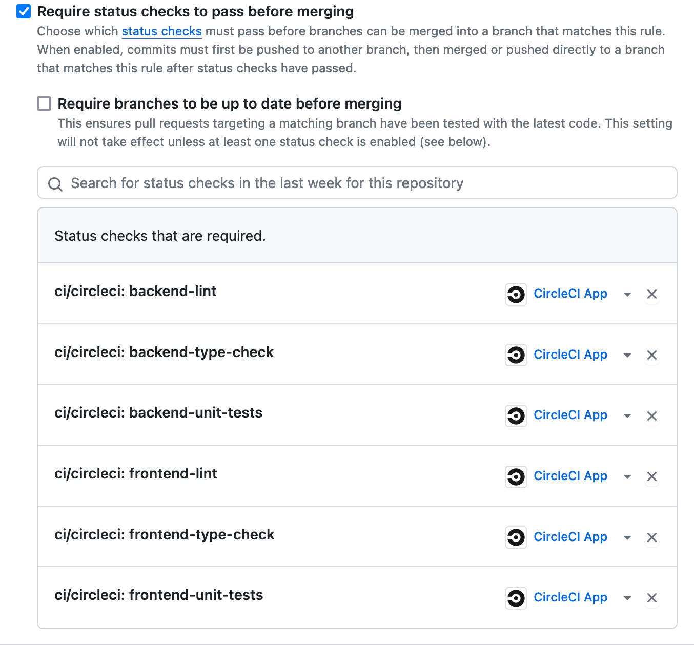

Open a Pull request (Be careful to target the `develop` branch of  **YOUR** forked repo)
- Assign your teammate and `@benjaminchazelle` as Reviewers
- Your teammate have to approve the PR (GitHub Pull request > Files changed > Review changes > Approve)
- Check the `ci/circleci: backend-*` and `ci/circleci: frontend-*` checks are green (if not, check the pipeline execution and fix the bad assertion ;))
- Merge it

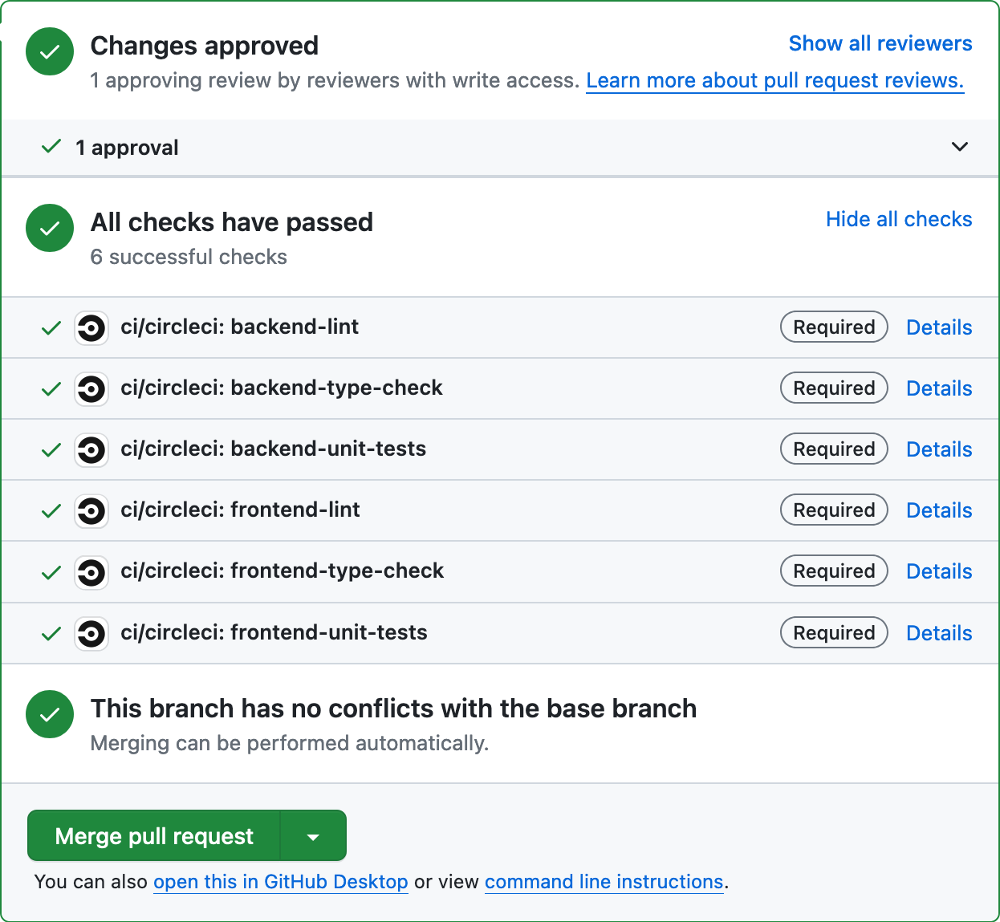

Fill the `Frontend CI` line in Google Sheet  

## Continuous deployment

Congratulations, your are done with the CI part.

Now CI is done, we can start to setup the Continuous Deployment. The goal is simple : every time something is merged in `main` branch, we want to build the JavaScript sources of the backend and frontend servers, release it on GitHub, and deploy it on the IBM Cloud instance.

## CD : Release

> A release is a specific snapshot of a project at a certain point in time, marking it as a stable or significant version. It often includes release notes, downloadable assets, and important information about changes since the last release.

Before to deploy the stable code, we want to release it in GitHub to maintain a clean history of each deployable version of our codebase.

At this step, we will use `semantic-release` that is an automated versioning and release tool for software projects. It determines the next version number based on commit messages and automates the release process, including generating release notes and publishing to package managers or version control systems.

Semantic-release looks to `BREAKING CHANGE:`, `feat;`, `fix:` prefix in commit messages to produce a major, a minor or a patch release. If you don't use any prefix, semantic-release will not produce any release.

That's why from this step, you will have to be careful your commit messages. For the rest of the project, prefix all your commit message with `feat:`  to indicate to semantic-release to create minor releases each time you merged into `main`.

Install `semantic-release` as dependency in the root `package.json`. Add a script to invoke the `semantic-release` command.

Create a `.releaserc` file on project root

```json
{
    "branches": ["master"]
}
```

Add a `release` job to the CD workflow that will be executed after the `build` one (check the CircleCI documentation to know how to execute jobs sequentially) that will invoke the `semantic-release` script from the root `package.json`. 

Using `semantic-release`, you will need to define a `GITHUB_TOKEN` environment variable containing a GitHub personal access token to make it able to add release to your repo.

More details here https://github.com/semantic-release/github#readme/blob/master/README.md#github-authentication

Generate a GitHub personal access token https://github.com/settings/tokens with `repo` scope.

Define an environment variable into your CircleCI project https://app.circleci.com  Projects > Your project > Project settings > Environment Variables > Add Environment Variable > `GITHUB_TOKEN` with the value of the generated token

Check that your `release` job is well executed in CircleCI only when something is pushed in the `main`branch. In order to follow the git flow, it will be necessary to do many pull requests (`feat/add-release` > `develop` > `main`)

Check that the release is well created. You can see it into CircleCI pipeline execution details and check your GitHub repository releases.

Fill the `CD: Release` line in Google Sheet  

## CD : Build

> The build refers to the process of converting source code into a deployable or executable form, typically through transpilation, bundling, and optimization steps to generate the final output that can be run by a computer or used within an application.

Add a `build_and_deploy` job that will install the backend and frontend projects and build them via the dedicated npm scripts (for now, we will only implement the build part, deploy comes in next part).

Tip : In CircleCI YAML, you can define a block of commands this way:

```yaml
- run: |
    echo 123
    echo 456
    echo 789
```

Add it into a new workflow `cd-workflow` that will be executed **only** when something is merged/pushed into `main` branch (find how to define a branch filtering in the CircleCI documentation mentioned in the `.circleci/config.yml` file).

Check that your job is well executed in CircleCI only when something is pushed in the `main`branch. In order to follow the git flow, it will be necessary to do many pull requests (`feat/add-build` > `develop` > `main`)

You should have something like that for backend build :

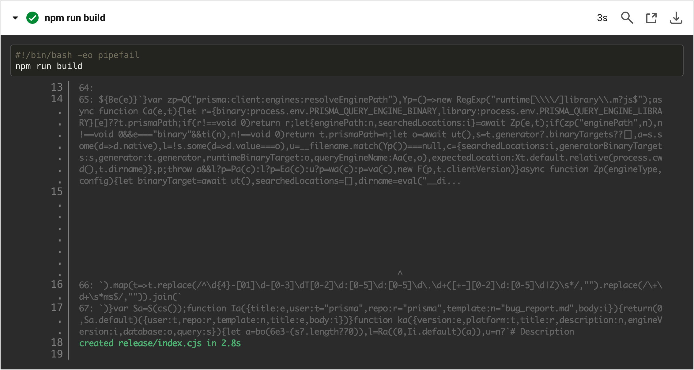

And something like that for frontend build: 

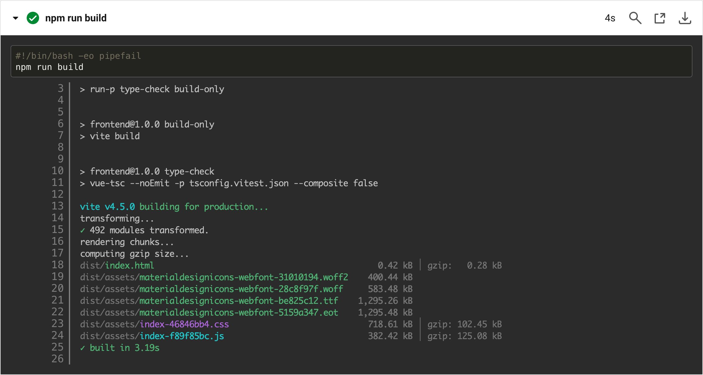

Note : At this step, this job is almost useless because nothing is done with the built file. The only interest is to check the build is correctly done. The final goal is to deploy the built code.

Fill the `CD: Build` line in Google Sheet 

## CD : Deploy

> In CI/CD, "deployment" refers to the process of taking a built software application or update and making it available for use, typically on a server, cloud platform, or other production environment. This step ensures that the latest changes are successfully integrated and accessible to end-users or systems.

The IBM Cloud instance is configured with two Linux services to run the backend server and serve the frontend :
- The backend service `backend-service` run `DB_PATH=file:/root/data/store.db node index.cjs` in `/root/backend/current/` in working directory.
- The backend service `frontend-service` run `npx serve . --port 5173` in `/root/frontend/current` in working directory.

Our goal is to update the content of these `current` directories in the CD pipeline, with the file built in the previous step.

Actually, `current` directories are not directories but symbolic links unto the directories of the release we really used in production. Using symbolic link is a safer approach to avoid to serve a release partially deployed, that could be very problematic.

Basically, here is the process to deploy :
- We copy the new release build file on the server on a new directory
- We delete the `current` symbolic link targeting an old release, and recreate it to target the new target
- Restart the service to serve the new release code
- (Clean old release directory, we will do it in a further bonus step)

On IBM Cloud instance, we can use SSH to transfer files and execute remote command. For educational purpose, we will use here a classic username/password authentication, but keep in mind that SSH key pair is a better approach (EDITOR'S NOTE : for security reason I cannot give you an access to the IBM Cloud dashboard allowing to defining SSH key pair). 

Username/password SSH authentifcation an be done thanks to `sshpass`command. In `node:lts` Docker image, it appears that `sshpass` is not installed, you can install it via aptitude into job step :

```yaml
- run: sudo apt-get update && sudo apt-get install -y sshpass
```

Here is how to copy file via SSH :

```bash
sshpass -p 'password' scp /path/to/local/file username@remotehost:/path/to/destination/
```

Here is how to execute remote commnd via SSH :

```bash
sshpass -p 'password' ssh username@remotehost "the_remote_command"
```

Due to the fact we are not using a classic SSH key pair to authenticate the remote instance, host verification will probably failed. `scp` and `ssh` commands can receive an option `-o StrictHostKeyChecking=no` that disable the host key checking. For educational purpose, we will accept to do it, but be aware that in real life, it is very not recommended to do it.

Ask the teacher for a IBM Cloud instance IP (remote host), and a username/password. Special thanks to IBM that offer $200 of free credit to do this kind of tests.

Add the username and the password as CircleCI project environnent variables (`USERNAME` and `PASSWORD`) to not version your credentials into GitHub for obvious security reasons.

At any moment, you are free to access directly the instance via `ssh`command. This could help you to debug symlinks for example.

Complete the `build_and_deploy` job :
- Set the name of the new release directory into a bash variable to reuse it in next steps
	- `RELEASE_DIRECTORY=$(date +"%Y-%m-%dT%H_%M_%S")`
- After build, copy the backend build directory content to the remote instance, in a new release directory in `/root/backend/releases` (hint: `scp`, `$RELEASE_DIRECTORY`, `$USERNAME`, `$PASSWORD`)
- Delete and recreate the `/root/backend/current` symlink (hint: `rm`, `ln -s`)
- Restart the backend service with `sudo systemctl restart backend-service`
- Do the same for frontend stuff

Hint : Use a block of command to be able to reuse `RELEASE_DIRECTORY` variable.

Check that your job is well executed in CircleCI only when something is pushed in the `main`branch. In order to follow the git flow, it will be necessary to do many pull requests (`feat/add-deploy` > `develop` > `main`)

Check CircleCI pipeline execution details and check you can effectively access the code you deployed into your browser (backend should be accessible on `http://<remote IP>:3000`  and frontend on `http://<remote IP>:5173`).

Note : For the frame of this course, 

You can try to edit the `Rock'n'roll` in the backend or the `The Sherlock and Watson App` header in the frontend to be sure you're CD is ok.

Fill the `CD: Deploy` line in Google Sheet 

## Claim your reward

Show an end-to-end git flow (`feat/add-deploy` > `develop` > `main` > Cloud instance) proving your CI/CD is working fine.

If it is, you will win your sweet chocolated reward =)

## Bonus 1 : Optimize Frontend CI triggering

Add file pattern to avoid to do useless tests.

When only frontend files are changed, only frontend CI workflow should be executed

Note : For backend, it is not so simple because TypeScript definitions have an impact over frontend files

## Bonus 2 : Optimize node_modules install
  
Add cache for `node_modules` to avoid to download again all dependencies on each `npm install`

```
      - node/install-packages:
          cache-path: ~/project/node_modules
          override-ci-command: npm install
```

## Bonus 3 : CD : Clean old release directories

At the end of the `build_and_deploy` job, append a step to clean old release directories that could exist.